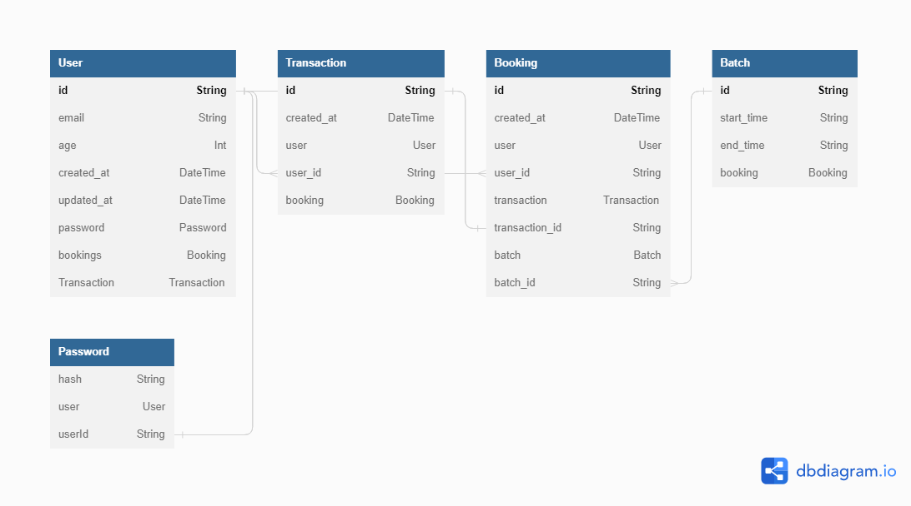
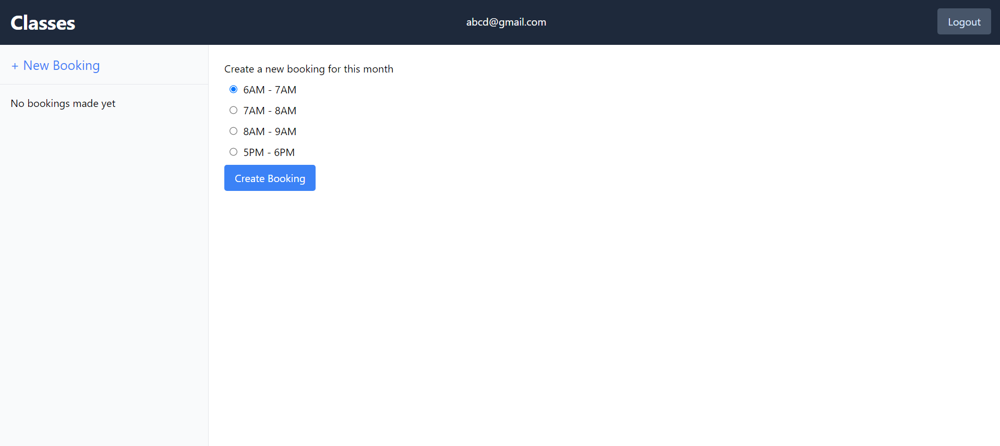
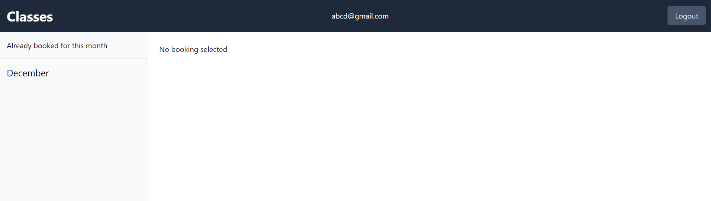
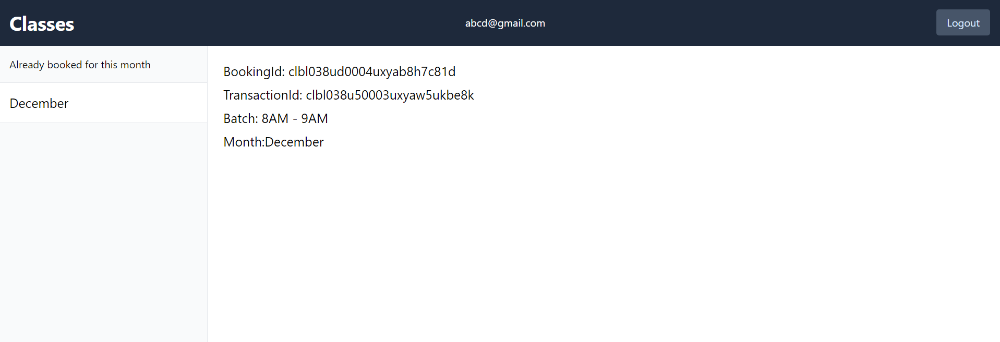

# Class Manager

Application built using React Remix for Coding Assignment.

## Tech Stack

- Remix: The Remix web framework was used. Remix is a new full stack javascript framework. It has several features which reduce the amount of boilerplate required when interacting with backends and thus used it in this project. The API functionality is built using Remix itself.
- Database: Postgres
- Docker: Docker is used for the container. Docker compose is used for ease of deployment.
- Prisma: Is an ORM for Node.js. Helps achieve end to end type safety across the project.

The project was scaffolded using [Remix blues stack](https://github.com/remix-run/blues-stack). This generates the boilerplate necessary for docker files, database deployment etc. This helped me focus on directly solving the problem.

## Run Instructions

```
npm install
npm run docker
npm run setup
npm run build
npm run dev
```

## Schema and Solution



There is a `Users` and `Password` table responsible for handling user accounts using a `email` and `password` combination. Email uniquely identifies the user.

### Assumptions

- The user signs up for specific months, i.e. the directly in the month they are paying. For e.g. if they are buying on 30 Jan, then even though they are paying full amount, their susbscription lasts only till 31 Jan. From February they have to pay again.
- Timezone is set to be UTC.

Checks related to age verification, and similar validations like name length, password length etc have been implemented.
If the user does not fall in the specified range, then they would fail to register.

`Transactions` which record payment history, and `Booking` which record class history are two separate tables, but they have a `1-1` relation between them as each booking points to one unique transaction.

`Batch` stores the timings which are allowed. Currently four different slots are given, as per the problem statement but that can be changed accordingly.

A user starts by selecting which batch they want, and then proceed to create a new `Booking`. As payment is assumed to correct, we proceed to create a new transaction and booking in one postgres transaction, so that it becomes one atomic operation. This is important as transactions and bookings are linked to one another, and must be consistent with each other.

`Booking` has a `created_at` timestamp. This denotes in which month did the transaction occur. This also specifies which

## Screenshots





## Future Implementations

One of the possible scalable solutions can be using Postgres triggers and stored procedures. Currently there is a manual check performed whether we have already booked for that month or not, but we can automate this process.

We can allow the user to update their preferences for next month and store that in another column in the `Booking` table. Then we can create a procedure, which will run one month from a specified date. This procedure's responsibility is to update the table so that the preferences are set.

```sql
CREATE OR REPLACE FUNCTION update_booking()
RETURNS TRIGGER AS $$
BEGIN
  IF NEW.end_date < CURRENT_DATE THEN
    NEW.batch = '...';
  END IF;
  RETURN NEW;
END;
$$ LANGUAGE plpgsql;

CREATE TRIGGER update_booking
AFTER UPDATE ON booking
FOR EACH ROW
EXECUTE PROCEDURE update_booking();

```

Above is pseudocde for the same. Using the above methodology we can automate the batch updation process. We can also include checks with payment in the above code so that the user has paid before the procedure executes.

For checking payments, `cron` jobs can be set up. We can specify exactly when we want tasks to run. With this we can set up a procedure to run automatically after a month, so that the user's payment status will be changed to false.
